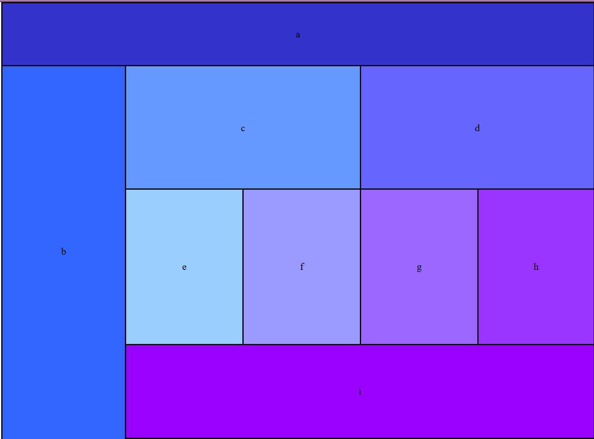
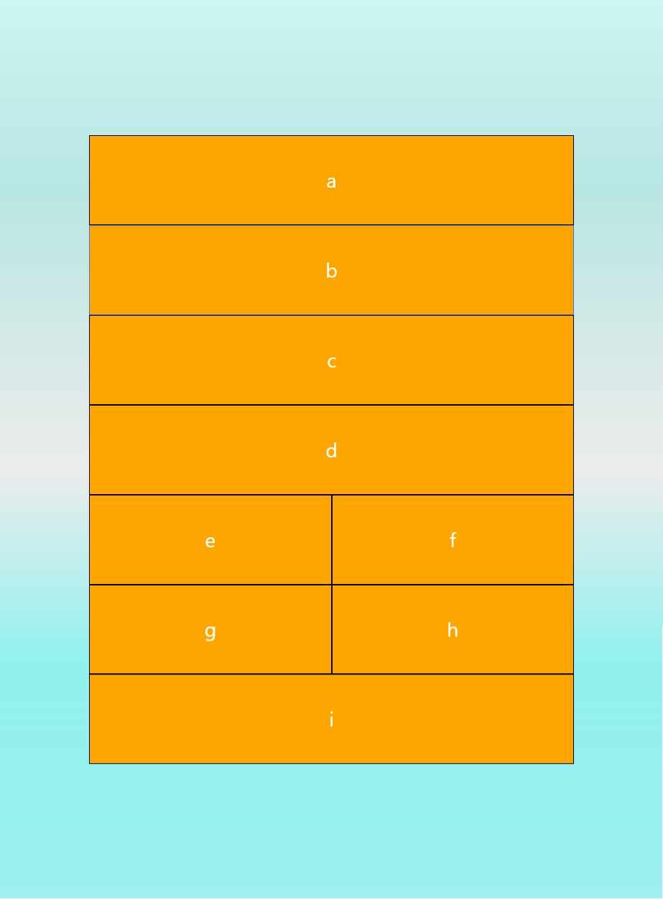

# My Project

## Description
This project involves two main tasks:
1. **Responsive Design with Bootstrap**: Create a layout based on a given design that changes appearance when the screen size is reduced.
2. **Bootstrap Components Integration**: Add a navbar, form, table, and spinner using Bootstrap.

## Task 1: Responsive Design with Bootstrap

### Objective
- Create a layout based on the provided design using Bootstrap.
- Ensure the layout adjusts responsively when the screen size is reduced.

### Implementation
1. **Include Bootstrap CSS and JS**:
    ```html
    <link href="https://maxcdn.bootstrapcdn.com/bootstrap/4.0.0/css/bootstrap.min.css" rel="stylesheet">
    ```

2. **Place the Images in the Project Folder**:
    - Create a folder named `images` inside the project directory.
    - Add your images (`image1.jpg` and `image2.jpg`) to this folder.

3. **Create the Layout task**:
    - **In Full Screen Like This**:
  
         


    - **In Small Screen Like This**:
  
    - 
      

## Task 2: Bootstrap Components Integration

### Objective
- Add a navbar, form, table, and spinner using Bootstrap.


### Contact
- **Email**: nedaaalyasin@gmail.com
- **GitHub**: [Your GitHub Profile](https://github.com/nedaa2024)

---

Thank you for visiting this project! Feel free to contribute or provide feedback.
